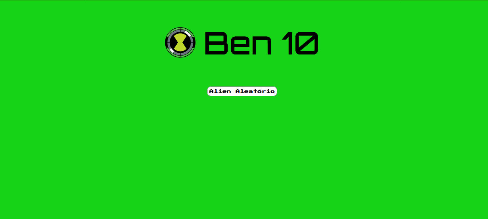
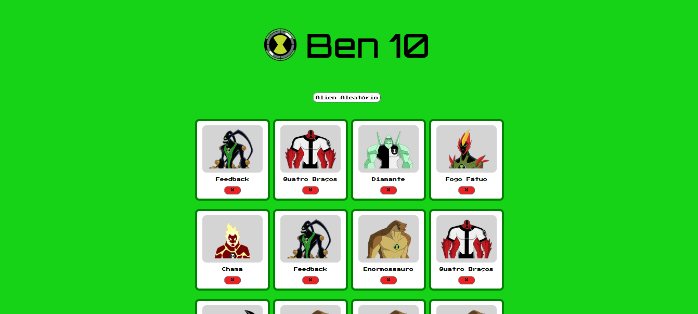

# Atividade Prática - Geração de Cards Aleatórios
## Objetivo

Nesta atividade iremos praticar conceitos novos de CSS e JavaScript.

Durante o desenvolvimento da atividade vocês irão utilizar:

* CSS Grid;
* Vetores (Arrays);
* Manipulação do DOM;
* Criação dinâmica de elementos HTML;
* Eventos de clique.

---

## Resultado Esperado

### Página Inicial




---

### Página Após Interação




---

# CSS Grid

## O que é Grid?

Grid é um recurso do CSS utilizado para organizar elementos em linhas e colunas.

Ele é muito utilizado para criar galerias de imagens, catálogos de produtos e layouts de páginas.

---

## Transformando um elemento em Grid

Para utilizar Grid, devemos aplicar a propriedade:

```css
display: grid;
```

Exemplo:

```css
#container {
    display: grid;
}
```

---

## Criando colunas

Podemos definir quantas colunas existirão utilizando:

```css
grid-template-columns;
```

Exemplo:

```css
#container {
    display: grid;

    grid-template-columns: 25% 25% 25% 25%;
}
```

Nesse caso o container será dividido em quatro colunas.

---

# O que o programa deve fazer

O tema da página é livre.

Você pode criar uma galeria sobre:

* Filmes;
* Jogos;
* Personagens;
* Animais;
* Carros;
* Séries;
* Times;
* Qualquer outro tema de sua preferência.

---

## Requisitos

A aplicação deve possuir:

* Um título principal;
* Um botão para adicionar novos cards;
* Um container organizado utilizando Grid;
* Pelo menos 5 imagens diferentes;
* Um vetor contendo os caminhos das imagens;
* Um vetor contendo os nomes dos elementos exibidos.

---

## Funcionamento

Ao clicar no botão:

1. Um número aleatório deve ser gerado;
2. Esse número será utilizado como índice dos vetores;
3. Um novo card deverá ser criado dinamicamente;
4. O card deverá ser adicionado ao container.

Cada card deve conter:

* Uma imagem;
* Um nome ou descrição;
* Um botão para remoção.

---

## Removendo Cards

Cada card deverá possuir um botão responsável por removê-lo da página.

Ao clicar nesse botão, apenas o card selecionado deverá ser removido.

---

# Estrutura Sugerida

Exemplo de card:

```text
+------------------+
|                  |
|      IMAGEM      |
|                  |
+------------------+

Nome do Item

[ X ]
```

---

# Dicas

## Criando elementos pelo JavaScript

Podemos criar elementos utilizando:

```javascript
const elemento =
    document.createElement("div");
```

---

## Adicionando elementos na página

```javascript
container.append(elemento);
```

---

## Alterando conteúdo

```javascript
titulo.innerText =
    "Novo Título";
```

---

## Alterando atributos

```javascript
imagem.src =
    "imagens/exemplo.png";
```

---